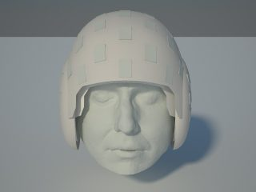

# analyse_OPMEG
### Scripts to analyse data acquired from the OPM Lab, UCL

Copyright (C) 2020 Wellcome Trust Centre for Neuroimaging

Authors:  Robert Seymour      (rob.seymour@ucl.ac.uk);
          Nicholas Alexander  (n.alexander@ucl.ac.uk);
          Tim West
          
### Example Analysis Scripts and Tutorials:
-  [Load in OPM data and denoise using Mean Field Correction and/or DSSP](./test_scripts/sample_load_in_OPMdata.m)
- [More Complex Data Denoising](https://github.com/FIL-OPMEG/NR4M) *work in progress*
- Whole-brain LCMV beamforming with an individual Freesurfer-derived cortical mesh *coming soon*
- Whole-brain DICS beamforming with an individual Freesurfer-derived cortical mesh *coming soon*
- Atlas-based beamforming with an individual Freesurfer-derived cortical mesh *coming soon*

- [OPM Benchmarking Analysis Scripts](https://github.com/FIL-OPMEG/opm_benchmarking_2020) *work in progress*

---------------------------------------------------------------------------
These are now a little out of date
- [Finger Abduction (Beta Desync)](./test_scripts/test_motor_data.ipynb)
- [M170 Faces](./test_scripts/html/M170_pipeline.html)
----------------------------------------------------------------------------

- [Extract Sensor Pos and Ori example](./test_scripts/html/extractSensorPositions_Example.html)

