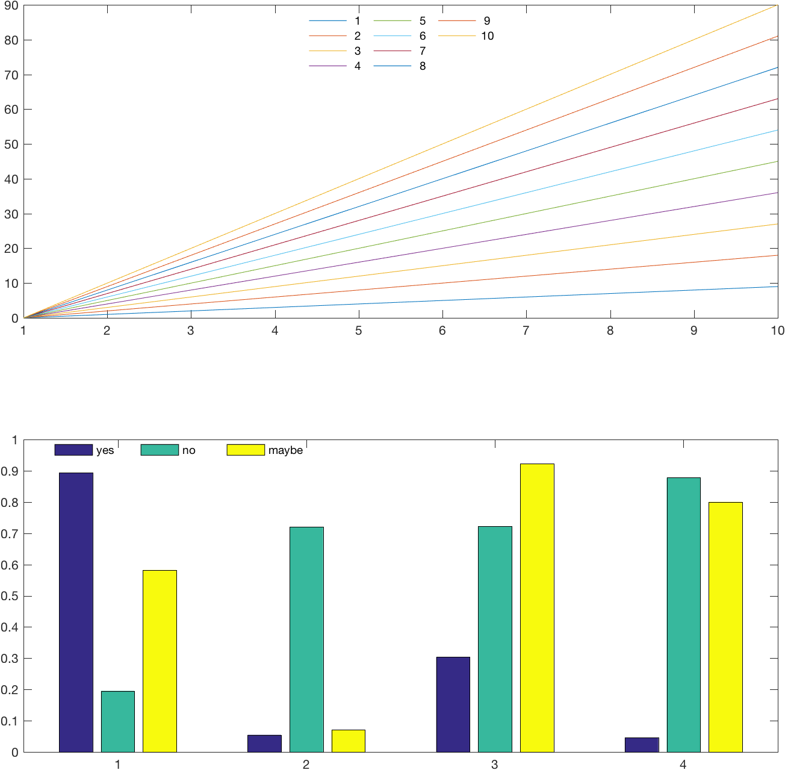

# UPDATE:
As of Matlab 2018a, legend() now supports columns, so function will no longer be maintaine:
https://www.mathworks.com/help/matlab/ref/legend.html#d117e809522

# columnlegend
Creates a legend with a specified number of columns


```
columnlegend creates a legend with a specified number of columns.
    
    columnlegend(numcolumns, str, varargin)
        numcolumns - number of columns in the legend
        str - cell array of strings for the legend
        
    columnlegend(..., 'Location', loc)
        loc - location variable for legend, default is 'NorthEast'
                   possible values: 'NorthWest', 'NorthEast', 'SouthEast', 'SouthWest', 
                                    'NorthOutside', 'SouthOutside',
                                    'NortheastOutside', 'SoutheastOutside'
 
    columnlegend(..., 'boxon')
    columnlegend(..., 'boxoff')
         set legend bounding box on/off
 
    example:
       legend_str = []; 
      
            plot(x); hold on; 
            legend_str = [legend_str; {num2str(i)}];
       end
       columnlegend(3, legend_str, 'Location', 'NorthWest');
 
 
    Author: Simon Henin <shenin@gc.cuny.edu>
```
For example:
```
subplot(211); 
plot(bsxfun(@times, [0:9]',[1:10])); 
columnlegend(3, cellstr(num2str([1:10]')), 'location','north'); 
subplot(212);
bar(rand(4,3)); 
columnlegend(3,{'yes', 'no', 'maybe'}, 'location', 'northwest');
```



